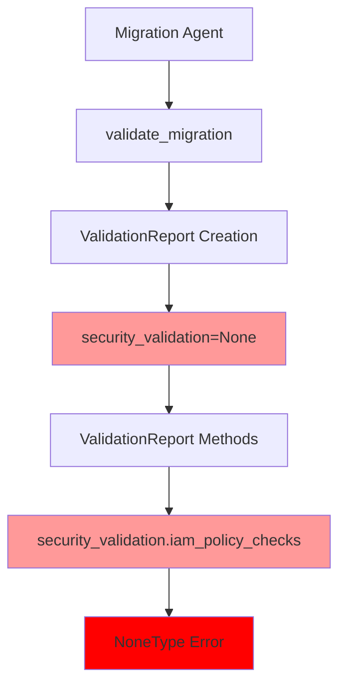
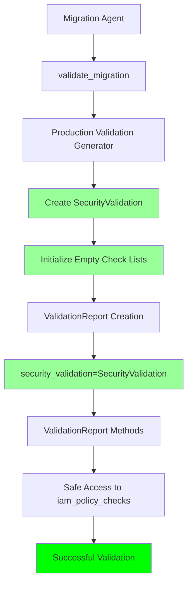
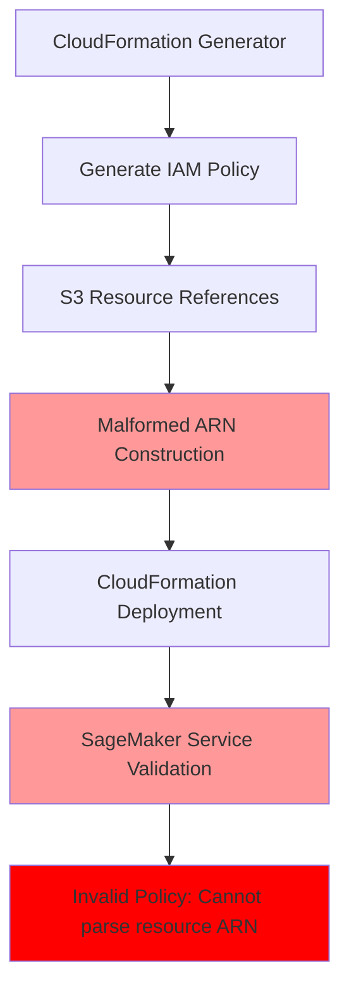
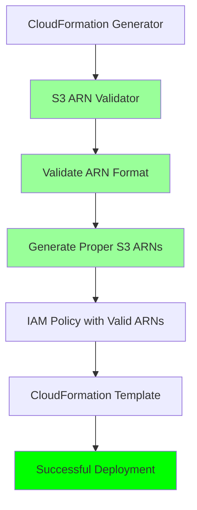

# Migration Tool Fix Design Document

## Overview

This design addresses two critical issues in the SageMigrator tool that prevent successful migration workflows:

1. **Validation Bug**: The `security_validation=None` causes null reference exceptions when accessing `iam_policy_checks`
2. **CloudFormation S3 ARN Bug**: Malformed S3 ARN references in generated CloudFormation templates cause deployment failures

The solution implements proper initialization of validation components with safe defaults and fixes S3 ARN formatting in CloudFormation templates to ensure successful end-to-end migration workflows.

## Architecture

### Current Problem Architecture



### Fixed Architecture



### CloudFormation S3 ARN Problem Architecture



### Fixed CloudFormation S3 ARN Architecture



## Components and Interfaces

### 1. Enhanced Migration Agent

**Purpose:** Fix the validation initialization to create proper SecurityValidation objects instead of None.

**Key Changes:**
- Replace `security_validation=None` with proper SecurityValidation initialization
- Use Production Validation Generator to create validation components
- Implement fallback mechanisms for incomplete validation data

**Modified Methods:**
```python
def validate_migration(self, artifacts: MigrationArtifacts) -> ValidationReport:
    # Create proper SecurityValidation instead of None
    security_validation = self._create_security_validation(artifacts)
    
    validation_report = ValidationReport(
        # ... other fields ...
        security_validation=security_validation,  # Fixed: no longer None
        # ... other fields ...
    )
```

### 2. Enhanced Production Validation Generator

**Purpose:** Provide methods to create properly initialized SecurityValidation objects with safe defaults.

**New Methods:**
```python
def create_default_security_validation(self) -> SecurityValidation:
    """Create SecurityValidation with safe defaults"""
    
def create_placeholder_iam_checks(self) -> List[CompatibilityCheck]:
    """Create placeholder IAM policy checks"""
    
def create_placeholder_encryption_checks(self) -> List[CompatibilityCheck]:
    """Create placeholder encryption checks"""
```

### 3. Defensive ValidationReport Methods

**Purpose:** Ensure all ValidationReport methods handle empty validation lists gracefully.

**Enhanced Methods:**
```python
def has_errors(self) -> bool:
    """Check errors with null-safe access"""
    
def has_warnings(self) -> bool:
    """Check warnings with null-safe access"""
    
def get_errors(self) -> List[str]:
    """Get errors with safe list access"""
```

### 4. Enhanced CloudFormation Generator

**Purpose:** Fix S3 ARN formatting in generated CloudFormation templates to prevent deployment failures.

**Key Changes:**
- Implement S3 ARN validation for all IAM policy resources
- Fix CloudFormation intrinsic function usage for S3 ARN construction
- Add comprehensive S3 ARN format validation before template generation

**New Methods:**
```python
def validate_s3_arn_references(self, template: Dict[str, Any]) -> List[str]:
    """Validate all S3 ARN references in CloudFormation template"""
    
def fix_iam_policy_s3_arns(self, policy: Dict[str, Any]) -> Dict[str, Any]:
    """Fix S3 ARN formatting in IAM policy documents"""
    
def validate_cloudformation_intrinsic_functions(self, template: Dict[str, Any]) -> List[str]:
    """Validate CloudFormation intrinsic functions produce valid S3 ARNs"""
```

### 5. S3 ARN Validator Component

**Purpose:** Provide centralized S3 ARN validation and formatting functionality.

**Core Methods:**
```python
def validate_s3_resource_arn(resource: str) -> str:
    """Validate and fix S3 resource ARN format"""
    
def is_valid_s3_arn(arn: str) -> bool:
    """Check if ARN follows proper S3 format"""
    
def fix_s3_resource_format(resource: str) -> str:
    """Convert various S3 resource formats to proper ARN format"""
```

## Data Models

### Enhanced SecurityValidation
```python
@dataclass
class SecurityValidation:
    iam_policy_checks: List[CompatibilityCheck] = field(default_factory=list)
    encryption_checks: List[CompatibilityCheck] = field(default_factory=list)
    network_security_checks: List[CompatibilityCheck] = field(default_factory=list)
    access_control_checks: List[CompatibilityCheck] = field(default_factory=list)
    overall_security_score: float = 0.0
    
    @classmethod
    def create_placeholder(cls) -> 'SecurityValidation':
        """Create placeholder with safe defaults"""
```

### Validation Component Factory
```python
class ValidationComponentFactory:
    """Factory for creating validation components with safe defaults"""
    
    @staticmethod
    def create_security_validation(
        artifacts: MigrationArtifacts,
        detailed_checks: bool = False
    ) -> SecurityValidation:
        """Create SecurityValidation with appropriate level of detail"""
    
    @staticmethod
    def create_placeholder_checks(
        check_type: str,
        count: int = 0
    ) -> List[CompatibilityCheck]:
        """Create placeholder compatibility checks"""
```

### S3 ARN Validation Models
```python
@dataclass
class S3ARNValidationResult:
    """Result of S3 ARN validation"""
    is_valid: bool
    original_arn: str
    corrected_arn: str
    errors: List[str] = field(default_factory=list)
    warnings: List[str] = field(default_factory=list)

@dataclass
class CloudFormationValidationResult:
    """Result of CloudFormation template validation"""
    is_valid: bool
    s3_arn_errors: List[str] = field(default_factory=list)
    s3_arn_warnings: List[str] = field(default_factory=list)
    fixed_template: Optional[Dict[str, Any]] = None
```

### S3 ARN Pattern Constants
```python
class S3ARNPatterns:
    """S3 ARN format patterns and validation rules"""
    
    BUCKET_ARN_PATTERN = r"^arn:aws:s3:::[\w\-\.]+$"
    OBJECT_ARN_PATTERN = r"^arn:aws:s3:::[\w\-\.]+/.*$"
    VALID_BUCKET_NAME_PATTERN = r"^[\w\-\.]+$"
    
    @classmethod
    def is_valid_bucket_arn(cls, arn: str) -> bool:
        """Check if ARN is a valid S3 bucket ARN"""
    
    @classmethod
    def is_valid_object_arn(cls, arn: str) -> bool:
        """Check if ARN is a valid S3 object ARN"""
```

## Correctness Properties

*A property is a characteristic or behavior that should hold true across all valid executions of a system-essentially, a formal statement about what the system should do. Properties serve as the bridge between human-readable specifications and machine-verifiable correctness guarantees.*

### Property Reflection

After reviewing all the testable acceptance criteria from the prework analysis, I identified several areas where properties can be consolidated:

- **Validation Initialization Properties**: Many criteria relate to proper initialization of validation components (SecurityValidation, check lists, default values). These can be combined into comprehensive initialization properties.
- **Defensive Method Properties**: Multiple criteria about ValidationReport methods handling empty/None values can be consolidated into defensive programming properties.
- **API Compatibility Properties**: Several criteria about maintaining backward compatibility can be combined into API stability properties.
- **Error Handling Properties**: Various criteria about error handling and fallback behavior can be consolidated into comprehensive error handling properties.
- **S3 ARN Validation Properties**: Multiple criteria about S3 ARN formatting and validation can be combined into comprehensive ARN validation properties.
- **CloudFormation Template Properties**: Several criteria about CloudFormation template generation and validation can be consolidated into template correctness properties.

The following properties eliminate redundancy while ensuring comprehensive coverage:

### Property 1: Validation Component Initialization Safety
*For any* migration artifacts and validation configuration, the Migration_Agent should create ValidationReport objects with properly initialized SecurityValidation components where all check lists are valid (non-None) lists and default values are set appropriately.
**Validates: Requirements 1.1, 1.2, 1.4, 1.5, 2.1, 2.2, 2.3, 2.4, 2.5**

### Property 2: ValidationReport Method Defensive Behavior
*For any* ValidationReport object with empty or minimal validation data, all validation methods (has_errors, has_warnings, get_errors, get_warnings) should execute without throwing exceptions and return appropriate default values.
**Validates: Requirements 1.3, 3.1, 3.2, 3.3, 3.4, 3.5**

### Property 3: API Backward Compatibility
*For any* existing code that uses ValidationReport or Migration_Agent APIs, the behavior should remain consistent with expected results and method signatures should remain unchanged.
**Validates: Requirements 4.1, 4.2, 4.4**

### Property 4: Error Handling and Graceful Degradation
*For any* validation component initialization failure or missing validation data, the system should provide clear error messages, fall back to safe defaults, and continue operation with warnings rather than complete failure.
**Validates: Requirements 5.1, 5.2, 5.3, 5.4, 5.5**

### Property 5: S3 ARN Format Correctness
*For any* S3 resource reference in generated IAM policies or CloudFormation templates, the ARN format should follow the correct pattern (`arn:aws:s3:::bucket-name` for buckets, `arn:aws:s3:::bucket-name/*` for objects) and be parseable by AWS services.
**Validates: Requirements 6.1, 6.2, 6.3, 6.5**

### Property 6: CloudFormation S3 ARN Validation
*For any* generated CloudFormation template, all S3 ARN references in IAM policies should be validated for correct format, and the validation should provide specific error messages for any malformed ARNs detected.
**Validates: Requirements 7.1, 7.2, 7.3, 7.4**

## Error Handling

### Validation Initialization Error Handling

1. **SecurityValidation Creation Failures**
   - Automatic fallback to placeholder SecurityValidation with empty lists
   - Clear error logging indicating which validation component failed
   - Continuation of validation process with warnings

2. **Missing Validation Data**
   - Use of safe default values (empty lists, 0.0 scores)
   - Warning messages instead of fatal errors
   - Graceful degradation of validation functionality

3. **Null Reference Prevention**
   - Defensive initialization of all validation components
   - Null-safe access patterns in all ValidationReport methods
   - Comprehensive validation of object state before method execution

### CloudFormation S3 ARN Error Handling

1. **S3 ARN Format Validation Failures**
   - Automatic correction of common S3 ARN format issues
   - Clear error messages indicating specific ARN formatting problems
   - Fallback to wildcard permissions when ARN correction is not possible

2. **CloudFormation Template Generation Errors**
   - Pre-deployment validation of all S3 ARN references
   - Specific error messages for each malformed ARN with correction suggestions
   - Template generation failure prevention through comprehensive validation

3. **Deployment Error Prevention**
   - Validation of CloudFormation intrinsic functions that generate S3 ARNs
   - Early detection of ARN format issues before AWS deployment
   - Comprehensive testing of generated templates against AWS CloudFormation validation

### Recovery Mechanisms

1. **Validation Component Recovery**
   - Automatic creation of placeholder components when detailed validation fails
   - Fallback to basic validation when advanced validation is unavailable
   - Preservation of partial validation results when some components fail

2. **S3 ARN Recovery**
   - Automatic conversion of bucket names to proper ARN format
   - Correction of common ARN formatting mistakes (missing prefixes, incorrect patterns)
   - Fallback to permissive policies when specific ARN correction fails

3. **API Compatibility Recovery**
   - Maintenance of existing method signatures and behavior
   - Backward-compatible serialization formats
   - Preservation of existing test compatibility

## Testing Strategy

### Dual Testing Approach

The testing strategy combines unit testing for specific scenarios with property-based testing for comprehensive validation:

**Unit Tests:**
- Specific validation initialization scenarios with known inputs/outputs
- Edge cases for None values and empty validation data
- API compatibility verification with existing code patterns
- Error conditions and recovery mechanisms
- CloudFormation template generation with known S3 ARN patterns
- S3 ARN validation with specific malformed and correct examples

**Property-Based Tests:**
- Universal properties across all validation scenarios
- Comprehensive input coverage through randomization
- S3 ARN format validation across all possible bucket and object patterns
- CloudFormation template validation with randomly generated IAM policies
- Validation of correctness properties with 100+ iterations per test
- Each property test tagged with: **Feature: migration-tool-fix, Property {number}: {property_text}**

### Testing Framework Configuration

- **Framework**: pytest with hypothesis for property-based testing
- **Minimum Iterations**: 100 per property test
- **Test Categories**: 
  - Validation initialization testing
  - Defensive method behavior testing
  - API compatibility testing
  - Error handling verification
  - S3 ARN format validation testing
  - CloudFormation template validation testing

### Test Data Generation

- **Synthetic Migration Artifacts**: Generated MigrationArtifacts with various validation states
- **Validation Scenarios**: Different combinations of missing and present validation data
- **Error Injection**: Controlled introduction of validation initialization failures
- **API Compatibility**: Testing with existing code patterns and expected behaviors
- **S3 ARN Patterns**: Generated S3 bucket names, object paths, and malformed ARN variations
- **CloudFormation Templates**: Synthetic templates with various IAM policy configurations and S3 resource references
