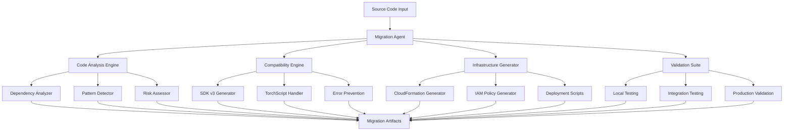

# SageBridge Design Document

## Overview

SageBridge is an intelligent EC2 to SageMaker migration system that addresses the key pain points experienced in manual migrations: SageMaker SDK compatibility issues, dependency conflicts, infrastructure complexity, and multiple iteration cycles. The system uses a multi-component architecture with specialized engines for analysis, code generation, and validation.

## Architecture

### High-Level Architecture



### Component Interactions

The Migration Agent orchestrates the entire process, with each specialized engine contributing to the final migration artifacts. The system follows a pipeline approach where each component builds upon the analysis from previous components.

## Components and Interfaces

### 1. Migration Agent (Core Orchestrator)

**Purpose:** Central coordinator that manages the migration workflow and integrates outputs from all specialized engines.

**Key Methods:**
- `analyze_source_code(source_path: str) -> AnalysisReport`
- `generate_migration_artifacts(analysis: AnalysisReport) -> MigrationArtifacts`
- `validate_migration(artifacts: MigrationArtifacts) -> ValidationReport`

**Interfaces:**
- Input: Source code directory path, configuration parameters
- Output: Complete migration artifacts package with validation reports

### 2. Code Analysis Engine

**Purpose:** Analyzes source code to identify patterns, dependencies, and potential migration challenges.

**Sub-components:**

#### Dependency Analyzer
- Parses requirements.txt, imports, and package usage
- Identifies SageMaker-incompatible packages (torchvision, seaborn, etc.)
- Maps dependencies to SageMaker-native alternatives
- Generates compatibility matrix with risk levels

#### Pattern Detector
- Identifies distributed training patterns (DataParallel, DistributedDataParallel)
- Detects data loading patterns and S3 integration opportunities
- Recognizes model saving/loading patterns
- Maps patterns to SageMaker equivalents

#### Risk Assessor
- Evaluates migration complexity based on detected patterns
- Assigns risk scores to different components
- Generates migration recommendations and priority order
- Identifies potential breaking changes

### 3. Compatibility Engine

**Purpose:** Generates SageMaker SDK v3 compatible code with proactive error prevention.

**Sub-components:**

#### SDK v3 Generator
- Converts training scripts to SageMaker-compatible format
- Uses current SageMaker SDK v3 syntax and patterns
- Implements LocalPipelineSession for local testing
- Generates proper estimator configurations with supported versions

#### TorchScript Handler
- Implements dual model saving (state_dict + TorchScript)
- Generates TorchScript-compatible inference handlers
- Creates fallback loading mechanisms
- Ensures inference container compatibility

#### Error Prevention Module
- Embeds model definitions in evaluation scripts
- Implements tar.gz extraction for SageMaker artifacts
- Generates proper execution role detection with fallbacks
- Includes retry logic and error handling patterns

### 4. Infrastructure Generator

**Purpose:** Creates complete infrastructure-as-code for production deployment.

**Sub-components:**

#### CloudFormation Generator
- Creates templates with proper resource dependencies
- Implements least-privilege IAM roles and policies
- Includes all required policy Sid fields
- Generates S3 buckets with encryption and lifecycle policies

#### IAM Policy Generator
- Uses specific resource ARNs instead of wildcards
- Implements proper trust relationships
- Includes SageMaker-specific permissions
- Validates policy syntax and compliance

#### Deployment Scripts Generator
- Creates deployment automation scripts
- Implements proper role assumption and region handling
- Generates pipeline execution and monitoring utilities
- Includes cleanup and cost management tools

### 5. Validation Suite

**Purpose:** Provides comprehensive testing and validation for all migration artifacts.

**Sub-components:**

#### Local Testing Generator
- Creates unit tests for training components
- Generates TorchScript compatibility tests
- Implements data loading and preprocessing tests
- Creates model evaluation and metrics tests

#### Integration Testing Generator
- Generates end-to-end pipeline tests
- Creates inference endpoint testing suites
- Implements performance benchmarking tools
- Generates monitoring and alerting validation

#### Production Validation Generator
- Validates security best practices
- Checks cost optimization settings
- Verifies monitoring and backup configurations
- Validates AWS Well-Architected compliance

## Data Models

### AnalysisReport
```python
@dataclass
class AnalysisReport:
    source_info: SourceCodeInfo
    dependencies: DependencyAnalysis
    patterns: PatternAnalysis
    risks: RiskAssessment
    recommendations: List[MigrationRecommendation]
```

### MigrationArtifacts
```python
@dataclass
class MigrationArtifacts:
    training_scripts: Dict[str, str]
    inference_handlers: Dict[str, str]
    pipeline_definitions: Dict[str, str]
    infrastructure: InfrastructureCode
    testing_suite: TestingSuite
    documentation: DocumentationPackage
```

### ValidationReport
```python
@dataclass
class ValidationReport:
    compatibility_checks: List[CompatibilityCheck]
    security_validation: SecurityValidation
    cost_analysis: CostAnalysis
    performance_benchmarks: PerformanceBenchmarks
    production_readiness: ProductionReadinessScore
```

## Correctness Properties

*A property is a characteristic or behavior that should hold true across all valid executions of a system-essentially, a formal statement about what the system should do. Properties serve as the bridge between human-readable specifications and machine-verifiable correctness guarantees.*

### Property Reflection

After reviewing all the testable acceptance criteria from the prework analysis, I identified several areas where properties can be consolidated:

- **Code Generation Properties**: Many criteria relate to generating code with specific patterns (SDK v3 syntax, TorchScript support, error handling). These can be combined into comprehensive code generation properties.
- **Dependency Management Properties**: Multiple criteria about dependency analysis and replacement can be consolidated into dependency handling properties.
- **Infrastructure Generation Properties**: CloudFormation, IAM, and deployment script generation can be combined into infrastructure properties.
- **Validation Properties**: Various validation criteria can be consolidated into comprehensive validation properties.

The following properties eliminate redundancy while ensuring comprehensive coverage:

### Property 1: Code Analysis Completeness
*For any* source code input, the Migration Agent should identify all SageMaker compatibility issues, dependency conflicts, and migration patterns, producing a complete analysis report with risk assessment and recommendations.
**Validates: Requirements 1.1, 1.2, 1.3, 1.4, 1.5**

### Property 2: SageMaker SDK v3 Compatibility
*For any* generated training script, pipeline definition, or estimator configuration, the code should use current SageMaker SDK v3 syntax, supported framework versions, and include proper error handling with retry logic.
**Validates: Requirements 2.1, 2.2, 2.4, 2.5**

### Property 3: TorchScript Model Compatibility
*For any* PyTorch model in the source code, the generated training script should save both state_dict and TorchScript versions, and the inference handler should support both loading methods with proper fallbacks.
**Validates: Requirements 2.3, 6.2**

### Property 4: Dependency Resolution Correctness
*For any* source code with dependencies, the Migration Agent should create SageMaker-compatible requirements, replace problematic packages with alternatives, and generate container customization when needed.
**Validates: Requirements 3.1, 3.2, 3.3, 3.4, 3.5**

### Property 5: Infrastructure Code Validity
*For any* generated CloudFormation template, IAM policy, or deployment script, the code should be syntactically valid, use specific resource ARNs, include required fields, and follow security best practices.
**Validates: Requirements 4.1, 4.2, 4.3, 4.4, 4.5**

### Property 6: Testing Suite Completeness
*For any* migration artifacts, the Validation Suite should generate comprehensive tests including local testing, TorchScript compatibility, inference testing, pipeline monitoring, and performance benchmarking.
**Validates: Requirements 5.1, 5.2, 5.3, 5.4, 5.5**

### Property 7: Model Registry Integration
*For any* model registration and deployment workflow, the generated code should include proper approval workflows, comprehensive endpoint testing, and cleanup utilities.
**Validates: Requirements 6.1, 6.3, 6.4, 6.5**

### Property 8: Error Prevention Robustness
*For any* generated SageMaker code, error prevention mechanisms should be included such as embedded model definitions, tar.gz extraction logic, role detection with fallbacks, and diagnostic utilities.
**Validates: Requirements 7.1, 7.2, 7.3, 7.4, 7.5**

### Property 9: Documentation Completeness
*For any* migration artifacts, comprehensive documentation should be generated including README files, migration guides, troubleshooting docs, deployment guides, and cost optimization recommendations.
**Validates: Requirements 8.1, 8.2, 8.3, 8.4, 8.5**

### Property 10: Incremental Migration Support
*For any* complex migration, the system should support component-by-component migration with dependency tracking, hybrid deployments, validation checkpoints, rollback mechanisms, and progress tracking.
**Validates: Requirements 9.1, 9.2, 9.3, 9.4, 9.5**

### Property 11: Production Readiness Validation
*For any* generated migration artifacts, the Validation Suite should verify security best practices, cost optimization, monitoring completeness, backup mechanisms, and AWS Well-Architected compliance.
**Validates: Requirements 10.1, 10.2, 10.3, 10.4, 10.5**

## Error Handling

### Migration-Specific Error Handling

1. **SDK Compatibility Errors**
   - Automatic detection of deprecated SDK patterns
   - Intelligent replacement with v3 equivalents
   - Fallback mechanisms for unsupported features

2. **Dependency Conflict Resolution**
   - Proactive identification of problematic packages
   - Automatic replacement with SageMaker-native alternatives
   - Container customization when replacement isn't possible

3. **Infrastructure Validation**
   - CloudFormation template syntax validation
   - IAM policy compliance checking
   - Resource dependency verification

4. **Runtime Error Prevention**
   - Model loading error prevention through dual saving formats
   - Artifact extraction error handling
   - Role assumption failure recovery

### Error Recovery Mechanisms

1. **Rollback Capabilities**
   - Component-level rollback for failed migrations
   - Infrastructure rollback through CloudFormation
   - Configuration rollback for deployment issues

2. **Diagnostic Tools**
   - Automated error diagnosis and suggestions
   - Log analysis and pattern matching
   - Performance bottleneck identification

## Testing Strategy

### Dual Testing Approach

The testing strategy combines unit testing for specific scenarios with property-based testing for comprehensive validation:

**Unit Tests:**
- Specific migration scenarios with known inputs/outputs
- Edge cases for dependency conflicts and SDK compatibility
- Integration points between components
- Error conditions and recovery mechanisms

**Property-Based Tests:**
- Universal properties across all migration scenarios
- Comprehensive input coverage through randomization
- Validation of correctness properties with 100+ iterations per test
- Each property test tagged with: **Feature: sagebridge, Property {number}: {property_text}**

### Testing Framework Configuration

- **Framework**: pytest with hypothesis for property-based testing
- **Minimum Iterations**: 100 per property test
- **Test Categories**: 
  - Code generation validation
  - Infrastructure template validation
  - Dependency resolution testing
  - Error handling verification
  - Production readiness validation

### Test Data Generation

- **Synthetic Source Code**: Generated Python training scripts with various patterns
- **Dependency Scenarios**: Different combinations of problematic and compatible packages
- **Infrastructure Variations**: Various AWS resource configurations and constraints
- **Error Injection**: Controlled introduction of common migration issues